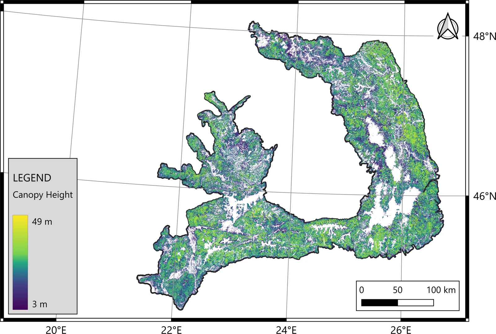
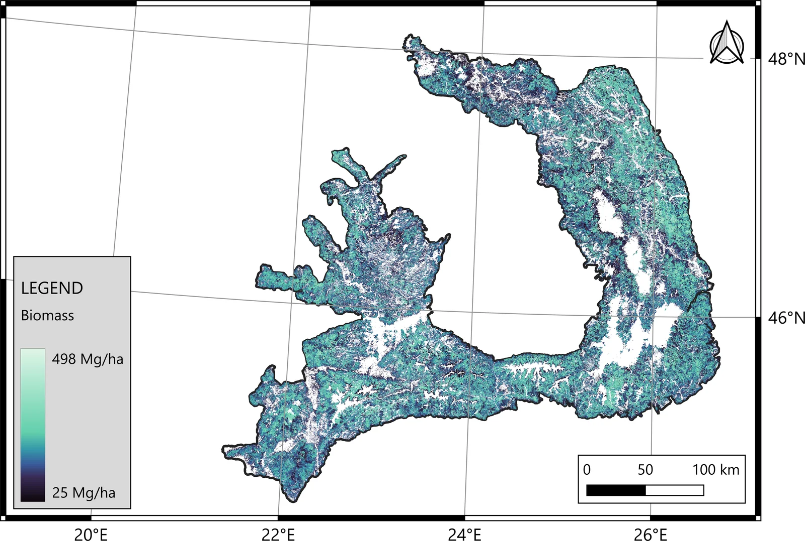

# RoCarp-CHM-AGB

**Canopy height and aboveground biomass of the Romanian Carpathian forests at 10 m**

> **Status — dataset in preparation.** The maps described on this page are being
> finalised. Public release is expected in **Q1 2027**, together with the
> accompanying peer-reviewed publication. This repository is the permanent entry
> point: the download links and the dataset DOI will appear here.
>
> **Landing page:** https://mihnea13.github.io/rocarp-chm-agb/

---

## What this is

RoCarp-CHM-AGB is a wall-to-wall, 10 m resolution mapping of two forest structural
variables — **canopy height (CHM)** and **aboveground biomass (AGB)** — across the
forests of the Romanian Carpathian arc.

The maps are produced by machine-learning models calibrated against spaceborne LiDAR
from **NASA GEDI** (L2A relative height metrics for canopy height, L4A for aboveground
biomass density) and applied to a multi-source predictor stack combining optical,
C-band SAR, L-band SAR and terrain data.

The CatBoost product is distributed with a per-pixel predictive uncertainty layer
estimated by the model itself, so that users can tell where the prediction is well
constrained and where it is not.

## Mapped products



*Predicted canopy height, 3–49 m.*



*Predicted aboveground biomass, 25–498 Mg ha⁻¹.*

Provisional output of the current model generation. The figures will be replaced with
the published version on release.

## Dataset specification

*Provisional — values marked (†) may still change before release.*

| | |
|---|---|
| **Variables** | Canopy height (m); aboveground biomass (Mg ha⁻¹) |
| **Spatial resolution** | 10 m |
| **Coordinate reference system** | EPSG:32635 — WGS 84 / UTM zone 35N |
| **Extent** | Forests of the Romanian Carpathian arc |
| **Format** | Cloud-Optimized GeoTIFF (COG) † |
| **No-data** | NaN |
| **Bands per product** | 1 — predicted value · 2 — predictive standard deviation (CatBoost product only) |
| **Value range** | Canopy height 3–49 m; biomass 25–498 Mg ha⁻¹ |
| **Reference period** | 2025 |
| **Forest definition** | Dynamic World derived forest mask |
| **Model families** | Random forest, XGBoost, CatBoost, convolutional neural network † |

The CatBoost product carries a second band with the model's own predictive standard
deviation, obtained from a gradient-boosted model fitted with a heteroscedastic loss.
It estimates the dispersion the model assigns to each individual prediction, and is
therefore spatially informative rather than constant. It is not a complete prediction
interval: it excludes the reference-data uncertainty of the GEDI footprint estimates,
the geolocation error propagated into predictor extraction, and the structural error of
the model family.

## Method, in brief

1. **Reference data.** GEDI L2A and L4A footprints over the study area, filtered for
   quality and beam sensitivity, with footprint geolocation refined against a
   high-resolution digital terrain model.
2. **Predictors.** Seasonal Sentinel-2 surface reflectance composites and derived
   vegetation indices; Sentinel-1 C-band backscatter; JAXA ALOS-2 PALSAR-2 L-band
   annual mosaic (HH, HV and dual-polarisation indices); elevation, slope and aspect
   derived from the ANCPI digital terrain model of Romania.
3. **Feature selection.** Recursive feature elimination with cross-validation over the
   full multi-source stack.
4. **Model training.** Spatially blocked cross-validation on a 30 × 30 km block grid,
   with hyperparameters tuned by Optuna.
5. **Prediction.** Block-wise application of the trained models to the full raster
   stack, restricted to the forest mask.

The full methodological description will accompany the publication.

## Data sources and attribution

Use of this dataset carries the attribution requirements of its inputs:

- **GEDI L2A / L4A** — NASA Global Ecosystem Dynamics Investigation, distributed by
  the LP DAAC and ORNL DAAC.
- **Sentinel-1 and Sentinel-2** — contains modified Copernicus Sentinel data
  (2024–2025), processed by the authors.
- **ALOS-2 PALSAR-2 yearly mosaic** — © JAXA/METI. Please cite Shimada et al. (2014),
  *Remote Sensing of Environment* 155, 13–31, as requested by the data provider.
- **Dynamic World** — Google / World Resources Institute, CC BY 4.0.
- **Digital terrain model** — digital terrain model of Romania at 1, 5 and 10 m
  resolution, distributed through the ANCPI geoportal; gap-filled and resampled to
  10 m by the authors.

The predictor stack itself is **not** redistributed here. Only the derived canopy
height and biomass products are released, together with the code needed to reproduce
them from the original sources.

## Licence

- **Data products** — [Creative Commons Attribution 4.0 International (CC BY 4.0)](https://creativecommons.org/licenses/by/4.0/). See `LICENSE-DATA`.
- **Code in this repository** — MIT. See `LICENSE`.

## How to cite

The dataset DOI will be minted on release. Until then, please cite this repository.

```
Cățeanu, M. & Oniga, V.-E. (2027). RoCarp-CHM-AGB: canopy height and aboveground
biomass of the Romanian Carpathian forests at 10 m [Data set]. Zenodo.
https://doi.org/10.5281/zenodo.XXXXXXX
```

## Release plan

| Stage | Expected |
|---|---|
| Dataset description and specification published here | 2026 |
| Peer-reviewed publication | Q1 2027 |
| Full raster products on Zenodo, with DOI | Q1 2027, with the publication |
| Processing code released | With the publication |

Zenodo issues a version-independent *concept DOI* that always resolves to the most
recent version of the record. That DOI, once minted, is the one to bookmark or cite
when a specific version is not required.

## Authors

**Mihnea Cățeanu** <sup>1,3,\*</sup> · ORCID [0000-0002-3692-1050](https://orcid.org/0000-0002-3692-1050)
**Valeria-Ersilia Oniga** <sup>2,3,4</sup> · ORCID [0000-0001-5433-2201](https://orcid.org/0000-0001-5433-2201)

<sup>1</sup> Department of Forest Engineering, Faculty of Silviculture and Forest Engineering, Transilvania University of Brașov, Brașov, Romania
<sup>2</sup> Department of Land Surveying and Cadastre, Technical University „Gheorghe Asachi" of Iași, D. Mangeron Street, Iași, Romania
<sup>3</sup> Faculty of Geodesy, Technical University of Civil Engineering Bucharest, Bucharest, Romania
<sup>4</sup> Romanian Society of Photogrammetry and Remote Sensing, Lacul Tei Blvd. 124, 020396 Bucharest, Romania

<sup>\*</sup> Corresponding author: [cateanu.mihnea@unitbv.ro](mailto:cateanu.mihnea@unitbv.ro)

## Contact

Questions about the dataset, requests for early access for a specific application, or
proposals for collaboration: [cateanu.mihnea@unitbv.ro](mailto:cateanu.mihnea@unitbv.ro)

Watch this repository to be notified when the data are released.
